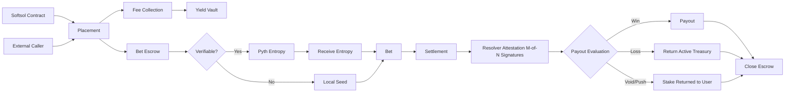

The Player Account Management instructions handle the full lifecycle of a bet — from placement through to settlement.

## Program details

| Network | Address |
|---|---|
| Solana Mainnet | `softQJxtQgY5fcAV3CKjxSRpzhAT4FWH6fhYCLsyEsn` |
| Solana Devnet | `softQJxtQgY5fcAV3CKjxSRpzhAT4FWH6fhYCLsyEsn` |

## Complete Flow

## Key concepts

<AccordionGroup>
  <Accordion title="Payout matrix">
    Each bet defines an ordered list of conditions and their corresponding payouts in basis points of the stake. Rows are evaluated top-to-bottom and the first match wins. A `null` payout returns the stake (void/push). If no row matches, the bet is a loss.
  </Accordion>
  <Accordion title="Resolvers">
    Off-chain services that observe real-world outcomes and sign attestations. Each bet defines its own resolver set and a minimum signature threshold (M-of-N), enabling trust models from a single operator up to fully decentralised multi-party agreement.
  </Accordion>
  <Accordion title="Verifiable randomness">
    Bets can opt into Pyth Fortuna for provable on-chain randomness. The VRF seed is written into the bet by `receive_entropy` after the keeper fulfils the request, and is included in the resolver attestation message so all parties commit to the same outcome.
  </Accordion>
  <Accordion title="Escrow">
    Funds are locked in a per-bet USDC escrow at placement (`amount + max_win`). Settlement pays the user from escrow and returns any remainder to the active treasury. The escrow account is closed at the end of settlement.
  </Accordion>
</AccordionGroup>
